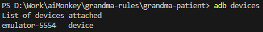
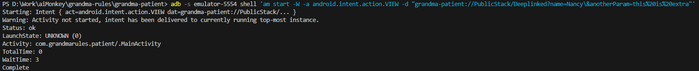

# grandma-patient

Mobile App (Patients) for Grandma Rules Project

## Testing deeplinking with ADB

For testing deeplinking with ADB on android use the following command:

> adb -s **[device-name]** shell 'am start -W -a android.intent.action.VIEW -d "**[schema]**://**[path-to-screen]**?**[queryparams]**"'

_note: if the adb command does not work, [you may need to setup your paths.](https://medium.com/@yadav-ajay/a-step-by-step-guide-to-setting-up-adb-path-on-windows-0b833faebf18)_

**[device-name]** is the name of the device to test on, it can be obtained with the command

> adb devices

**[schema]** is the schema setup in the [app.json file if using expo](app.json), or the [android manifest file](android/app/src/main/AndroidManifest.xml)

**[path-to-screen]** is the path setup through the [DeepLinkConfig object](src/utils/deeplinks/index.ts), by default it navigates the stacks like a folder structure, but can be changed through the config field in the DeepLinkConfig object ([see React Navigation official guide](https://reactnavigation.org/docs/configuring-links))

**[queryparams]** are parameters passed to the screen through the router, they will be accessible through the route.params object, they are formatted as url parameters like in normal http/https links.

example formed command:

> adb -s emulator-5554 shell 'am start -W -a android.intent.action.VIEW -d "grandma-patient://PublicStack/Deeplinked?name=Nancy\&anotherParam=this%20is%20extra"'

Note that in the example the **'&'** symbol in the parameters is escaped ('\\&'), this is due to the ADB and is not necessary when creating a deeplink normally.
